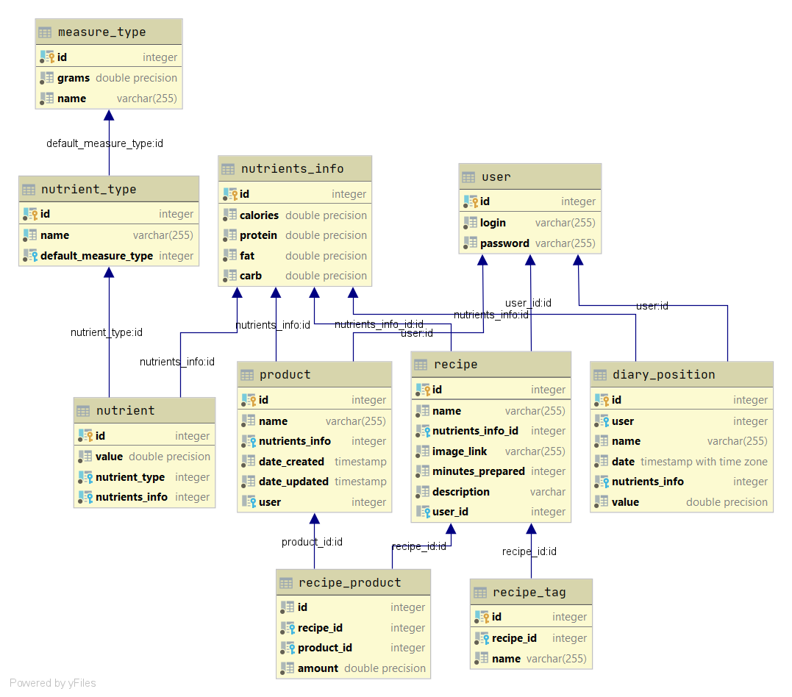
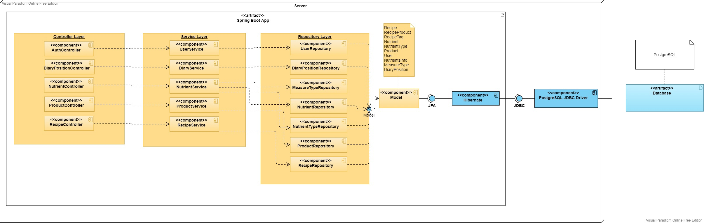
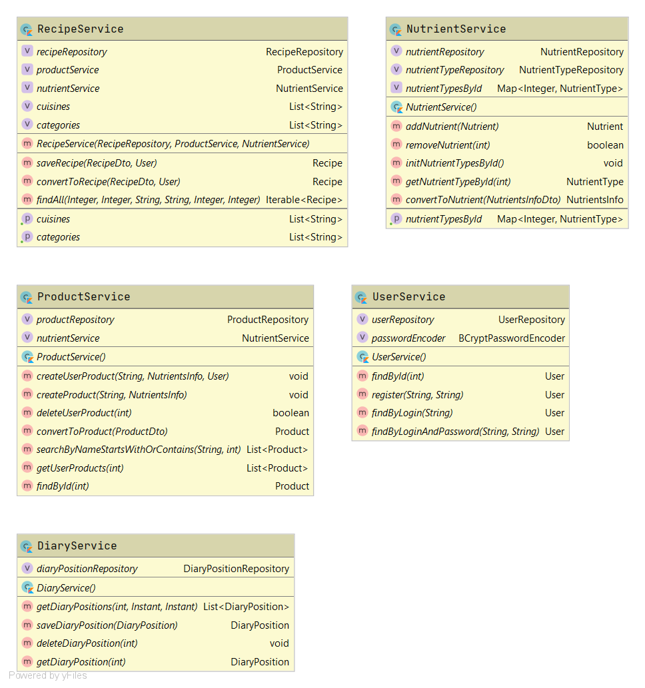
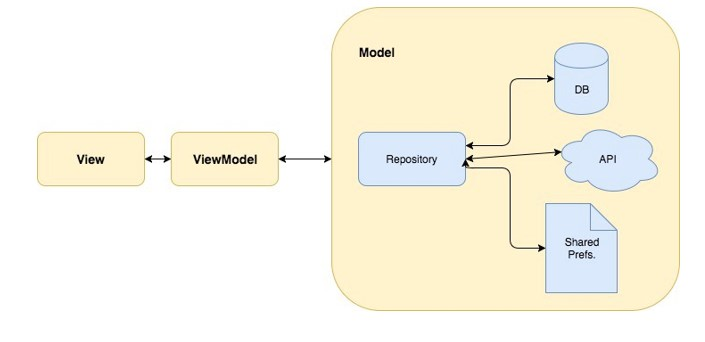

# FDiary - Food Diary

## Description

Food diary for tracking calories, protein, fat, carbs, vitamins, minerals and other nutrient levels. Final project for ITMO bachelor degree by Minin Aleksandr P3417.

## Installation

1) Clone the repository

2) Install PostgreSQL 9.6.1 (as docker container)

3) Initialize fdiary_backend as maven project in IntelliJ IDEA

4) Initialize fdiary_mobile as gradle project in Android Studio

5) Start web service (Spring Boot app with embedded tomcat web server)

6) Start mobile app using AVD or using physical mobile device connected to your PC (web service should be accessible in the same network as your mobile phone or AVD)

## DBMS

DBMS: PostgreSQL 9.6.1 (installed as docker container)

Database is initialized by web service during the first startup of web service.

## Web Service (/fdiary_backend)

**Maven project**

IDE: IntelliJ IDEA

Libraries and frameworks used in development:

1) Spring Boot

2) Spring Core

3) Spring Data (JDBC, JPA)

4) Spring Web

5) Spring Security

6) Jjwt (jsonwebtoken)

7) Java Validation API

8) Jackson

**Architecture:**

**Some of the services:**

## Mobile app (/fdiary_mobile)

**Gradle project**

IDE: Android Studio

Libraries & frameworks used in development:

1) Core & Fragment & Lifecycle-Livedata & Lifecycle-ViewModel KTX

2) Fragment

3) Retrofit2 

4) Picasso

5) AnyChart

6) Material

7) androidx.legacy:legacy-support-v4

8) androidx.appcompat:appcompat

**Based on the following architecture:**

